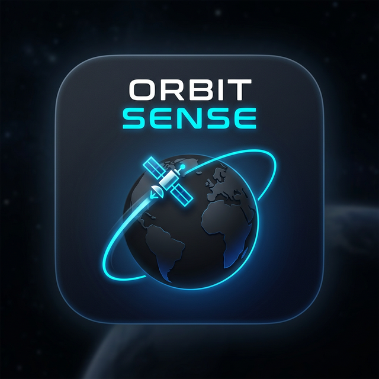

# 🛰 Orbit Sense

A real-time satellite tracking and visualization application written in **Rust**, featuring a live 2D world map, SGP4 orbital propagation, swath footprint rendering, and overhead pass prediction.

---

## Screenshot



---

## Features

| Feature | Details |
|---|---|
| **Live TLE Data** | Downloads satellite datasets from [CelesTrak](https://celestrak.org) at startup with parallel parsing |
| **Interactive 2D Map** | Pan and zoom world map powered by the `walkers` crate with tile caching |
| **Multi-Satellite Tracking** | Select and track multiple satellites simultaneously on the map |
| **Orbital Trail** | Projects the satellite's path over the next 90 minutes with optimized caching |
| **Swath Footprint** | Displays the satellite's view-cone as a filled polygon with memoized geometry |
| **Pass Prediction** | Predicts when satellites will pass within a configurable distance of your location |
| **Calendar Export** | Export predicted passes to iCalendar (.ics) format for importing into calendar apps |
| **Time Simulation** | Scrub through time with adjustable playback speeds (up to ±3600×) to visualize past/future positions |
| **Advanced Filters** | Filter satellites by altitude range (0-200,000 km) and inclination (0-180°) |
| **Observer Location** | Geocode any city or address via OpenStreetMap Nominatim |
| **Map Themes** | Switch between Light (OpenStreetMap) and Dark (CartoDB) basemaps |
| **Satellite Categories** | Visual, Starlink, Weather, GPS, Space Stations |
| **Persistent Settings** | Preferences and observer location are saved across restarts |

---

## Getting Started

### Prerequisites

- [Rust toolchain](https://rustup.rs/) (stable, 2024 edition)
- A working internet connection (for TLE data and map tiles)

### Build & Run

```bash
git clone https://github.com/arunkumar-mourougappane/orbit-sense.git
cd orbit-sense
cargo run
```

For a release build:

```bash
cargo build --release
./target/release/orbit-sense
```

---

## Usage

1. **Select a Satellite Category** from the dropdown in the left sidebar (defaults to *Visual — 100 Brightest*). TLEs are downloaded and parsed in parallel automatically on startup.
2. **Search** for satellites by name using the filter box, or narrow results using **Advanced Filters**:
   - Altitude range (0-200,000 km) to filter by orbital height
   - Inclination range (0-180°) to find polar, equatorial, or intermediate orbits
3. **Select satellites** by clicking them in the list. Multiple satellites can be selected simultaneously for comparison. The map displays all selected satellites with their swaths and trails.
4. **Time Controls** (bottom center):
   - Adjust playback speed from ⏪ -60× to ⏩ +60× (or use slider for up to ±3600×)
   - Click ▶/⏸ to play/pause time simulation
   - Click **Reset Time** to return to real-time tracking
5. **Set your Observer Location** by typing a city name or address (e.g. `Houston, TX`) and clicking **Search Location**. The app predicts the next overhead passes for selected satellites.
6. **Export Passes** by clicking the **Export to Calendar** button in the satellite info panel to save predicted passes as an .ics file compatible with Google Calendar, Outlook, and other calendar applications.
7. **Customize** via *File → Preferences*:
   - Map theme (Light / Dark)
   - Show/hide orbital trail
   - Swath footprint color and opacity
   - Pass distance threshold (km)
8. **Help → About** displays application metadata, license, and repository link.

---

## Architecture

```
orbit-sense/
├── src/
│   ├── lib.rs            # Crate root; feature overview and module map
│   ├── constants.rs      # Application-wide numeric constants
│   ├── location.rs       # Geocoding, geodetic maths, SGP4 observation calc
│   ├── satellites.rs     # CelesTrak TLE fetch & parse
│   ├── app.rs            # Core app state, eframe::App impl, settings persistence
│   └── ui/
│       ├── mod.rs        # UI module registry
│       ├── about.rs      # About dialog
│       ├── map.rs        # 2D map rendering, swath footprint, orbital trail
│       ├── overlay.rs    # Floating map controls and satellite info panel
│       ├── preferences.rs# Preferences window
│       └── sidebar.rs    # Left sidebar: location, category, satellite list
├── assets/
│   └── icon.png          # Application icon (embedded into binary at compile time)
└── Cargo.toml
```

### Key Crates

| Crate | Purpose |
|---|---|
| `eframe` / `egui` | Immediate-mode GUI framework |
| `walkers` | Slippy-map tile rendering for egui with caching |
| `sgp4` | Satellite orbital propagation (SGP4/SDP4) |
| `rayon` | Parallel processing for TLE parsing and position updates |
| `tokio` | Async runtime for TLE downloads and geocoding |
| `reqwest` | HTTP client for CelesTrak and Nominatim |
| `geocoding` | OpenStreetMap Nominatim geocoding |
| `rfd` | Native file dialogs for calendar export |
| `serde` / `serde_json` | Serialization for settings persistence |
| `chrono` | Date/time handling for time simulation and calendar export |
| `image` | PNG decoding for the embedded window icon |

---

## Settings Persistence

Preferences and observer location are automatically saved using `eframe`'s built-in cross-platform storage. No manual save step is required.

| Platform | Storage Path |
|---|---|
| Linux | `~/.local/share/orbit-sense/` |
| macOS | `~/Library/Application Support/orbit-sense/` |
| Windows | `%APPDATA%\orbit-sense\` |

---

## Satellite Propagation & Performance Notes

- Orbital positions are computed using the **SGP4** model via the `sgp4` crate.
- TLE data is sourced from [CelesTrak](https://celestrak.org) and refreshed on every launch. Parsing is parallelized using `rayon` for ~3-5× faster startup with large datasets (e.g., Starlink with 6000+ satellites).
- TEME-to-ECEF conversion uses a simplified GMST approximation sufficient for visualization purposes.
- **Multi-Satellite Tracking:** Position updates for all satellites run in parallel batches every second using `rayon::par_iter_mut()` for smooth 60fps rendering.
- **Optimized Caching:**
  - Satellite positions are cached and only recalculated when the delta exceeds 0.05°
  - Swath footprints (72-point polygons) are memoized per satellite in a HashMap
  - Orbital trails are cached with 60-second invalidation timers
  - Map tiles are cached locally in `~/.local/share/orbit-sense/tiles/`
- The swath (view-cone) footprint is derived from the satellite's altitude using Earth's mean radius (6,371 km).
  - To handle rendering the footprint array accurately when crossing the 2D plane bounds, `orbit-sense` splits and offsets the geometric polygon to seamlessly traverse the `-180`/`+180` longitude anti-meridian gap using circle approximation detection.
- **Pass Prediction:** The predictor searches the next 48 hours in variable minute-sized steps. It dynamically adjusts its geometric stride depending on distance from the target to drastically cut the CPU overhead required by SGP4 calculations, allowing instant calculation.
- **Time Simulation:** Users can adjust time offset and playback speed (±3600×) to visualize satellite positions in the past or future. All position calculations respect the simulated time via `current_time()`.
- **Calendar Export:** Predicted passes are exported to RFC 5545 compliant iCalendar (.ics) format with 10-minute event durations and distance metadata.

---

## License

This project is licensed under the **MIT License**. See [`LICENSE`](LICENSE) for details.

---

## Author

**Arunkumar Mourougappane** — [amouroug.dev@gmail.com](mailto:amouroug.dev@gmail.com)

Repository: [github.com/arunkumar-mourougappane/orbit-sense](https://github.com/arunkumar-mourougappane/orbit-sense)

---

*Satellite data sourced from CelesTrak · Orbital propagation via the SGP4 model*
